# Simulating ROS Navigation in Gazebo

Simulated environment in which programmers are able to interact and experiment with 3D models at their fingertips. Being able to test algorithms, design robots, monitor systems of networks are essential to a succesful project. With Gazebo, a programmer is able to make use of an incredible physics engine, high-quality graphical interfaces and robust programming to design real tools before they are created.

_This blog uses Ubuntu 18.04 with ROS Melodic and Gazebo 9. We assume that you have ROS and Gazebo already installed on your local system._

## Installing Nvidia

This project makes use of Nvidia hardware to lower resource consumption and make the simulation run smoothly!

### Nvidia Driver

```bash
sudo apt-get install nvidia-driver-470
sudo apt-get install nvidia-cuda-toolkit
nvcc --version
```

### Runtime Container

```bash
distribution=$(. /etc/os-release;echo $ID$VERSION_ID) \
   && curl -s -L https://nvidia.github.io/nvidia-docker/gpgkey | sudo apt-key add - \
   && curl -s -L https://nvidia.github.io/nvidia-docker/$distribution/nvidia-docker.list | sudo tee /etc/apt/sources.list.d/nvidia-docker.list
sudo apt-get update
sudo apt-get install -y nvidia-docker2
sudo systemctl restart docker
nvidia-smi
```

## Launch in Docker

Before we begin this tutorial, you can view the full project in docker!

- Make sure you have [docker](https://docs.docker.com/engine/install/) and [docker-compose](https://docs.docker.com/compose/install/) on your OS.
  - `docker -v`
  - `docker-compose --version`
- Open a new terminal. Clone the repo below:
  ```bash
  cd ~
  git clone https://github.com/dlakhiani/ros-navigation-local.git
  cd ros-navigation-local/src
  xhost local:docker
  docker-compose -f docker-compose.nvidia.yml build
  docker-compose -f docker-compose.nvidia.yml up
  ```
  > _Please do be patient when loading Gazebo, as it will take a bit of time due to it being a graphical client._
- To control the robot, open a new terminal and type:
  ```bash
  docker exec -it src_ros-develop_1 bash
  source devel/setup.bash
  roslaunch turtlebot_teleop keyboard_teleop.launch
  ```

## Workspace and project

- Feel free to skip this if you already have setup a workspace, if not:
  ```bash
  source /opt/ros/$ROS_DISTRO/setup.bash
  mkdir -p ~/sim_ws/src
  cd ~/sim_ws/src
  catkin_init_workspace
  cd ..
  catkin_make
  source ~/sim_ws/devel/setup.bash
  ```
- Lets create the project for this tutorial:
  ```bash
  cd ~/sim_ws/src
  catkin_create_pkg navigation_robot gazebo_ros urdf
  ```

## Gazebo Simulation Box

- Make sure you have [gazebo installed](http://gazebosim.org/tutorials?cat=install) on your OS.
- Launch an empty world of gazebo on your local system.

  - `gazebo`
    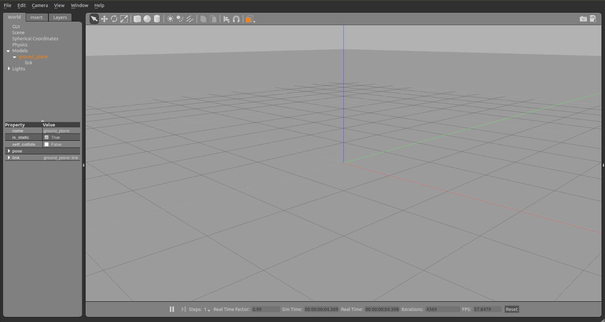

- You now have an empty world in gazebo.

## World files

A world in gazebo is just another word for a simulated environment for your experiments. Programmers can evaluate and test their robot in difficult or dangerous scenarios without any harm to the robot themselves.

- An equivalent method of creating an empty world in gazebo is using the `.world` file.
  ```bash
  cd ~/sim_ws/src/navigation_robot
  mkdir world
  cd world
  touch empty_world.world
  ```
- To make an empty world in gazebo using `.world`, use the following template:

  ```xml
  <?xml version="1.0" ?>

  <!-- simulation description format - describes models in xml -->
  <sdf version="1.5">
    <world name="default">

      <!-- sky -->
      <include>
        <uri>model://sun</uri>
      </include>

      <!-- ground -->
      <include>
        <uri>model://ground_plane</uri>
      </include>

    </world>
  </sdf>
  ```

- Save this under `empty_world.world`
- You can now load this file using:
  - `gazebo empty_world.world`

## Adding objects to the world

- Using the gazebo model database, adding objects are simple through a world file.
- Lets add a grey wall to our `empty_world.world` file above:

  ```xml
  <include>
    <uri>model://grey_wall</uri>
    <pose>0 0 0 0 0 3.14</pose>
    <name>wall_1</name>
  </include>
  ```

  - the term **uri** is used to specify the model we want to spawn into the gazebo environment, [find more here.](https://github.com/osrf/gazebo_models)
  - the term **pose** (_x y z roll pitch yaw_) determines the model's location and orientation in the gazebo environment.
  - the term **name** allows you to spawn several of the same model into the envionment, by just changing the model's name to a unique one.

- There are several more properties you can add to models in gazebo, [see here for more details.](http://gazebosim.org/tutorials?tut=build_model)

## Spawn a Robot in Gazebo

- Robots are like any other model, having multiple links, joints, plugins and, sensors. In this tutorial, we will spawn a **TurtleBot** !
  ```bash
  cd ~
  git clone https://github.com/dlakhiani/ros-navigation-local.git
  cd ros-navigation-local
  catkin_make
  source devel/setup.bash
  roslaunch turtlebot_navigation_gazebo main.launch
  ```
  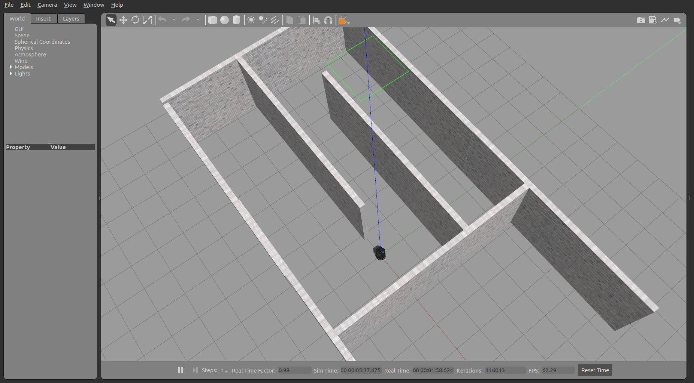

## Control the Robot

- Now that we have spawned a robot into a world in gazebo, lets try moving it! We can do this by using **teleoperation**!
  - `roslaunch turtlebot_teleop keyboard_teleop.launch`
    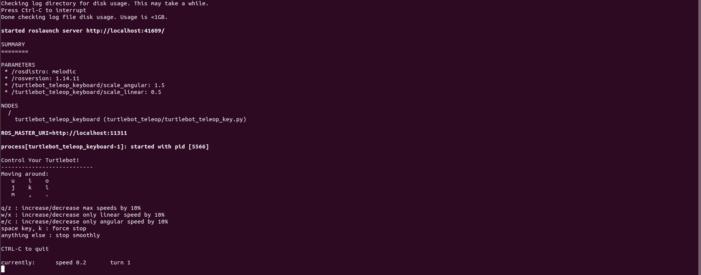
- Enjoy!

## Monitor Robot

### Rosnode

- ROS makes use of nodes to control the robot's publishers, subscribers and, other connections.
- It is used to computer and display debug information to the user, [read more here.](http://wiki.ros.org/rosnode)
  - `rosnode list` displays currently running rosnodes
    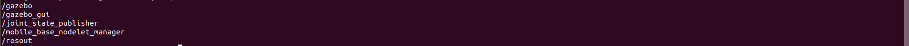
  - `rosnode info /gazebo_gui` provides the connections of the given rosnode
    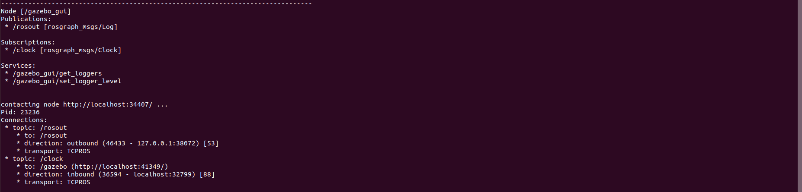

### Rostopic

- ROS nodes use topics to publish, subscribe, and send messages to/from the robot from/to the system network.
- With this, we are also able to view the type and content of the messages being sent to the user, [read more here.](http://wiki.ros.org/rostopic)
  - `rostopic list` displays currently running rostopics
    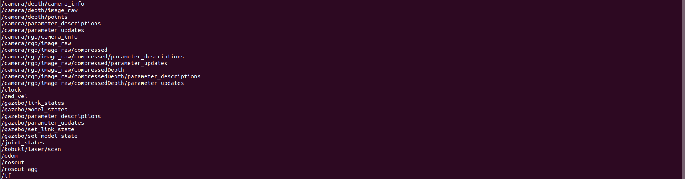
  - `rostopic info /cmd_vel` provides the type of message the topic communicates with, along with any publishers/subscribers that are linked to it
    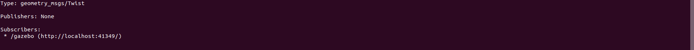
    > _By using this topic (cmd_vel), we were able to control the TurtleBot._
  - `rostopic echo /odom` prints the messages that is sent and received by the topic
    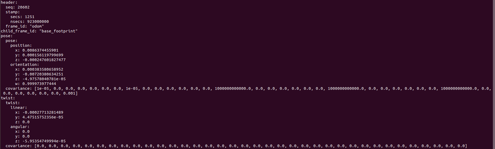

### Rviz

- Rviz is a program interface that allows the user to visually monitor simulated objects and their topics.
- It is incredibly helpful when experimenting with custom models and topics, [learn how to use it here!](http://wiki.ros.org/rviz/UserGuide)
  - `roslaunch turtlebot_rviz_launchers view_model.launch`
    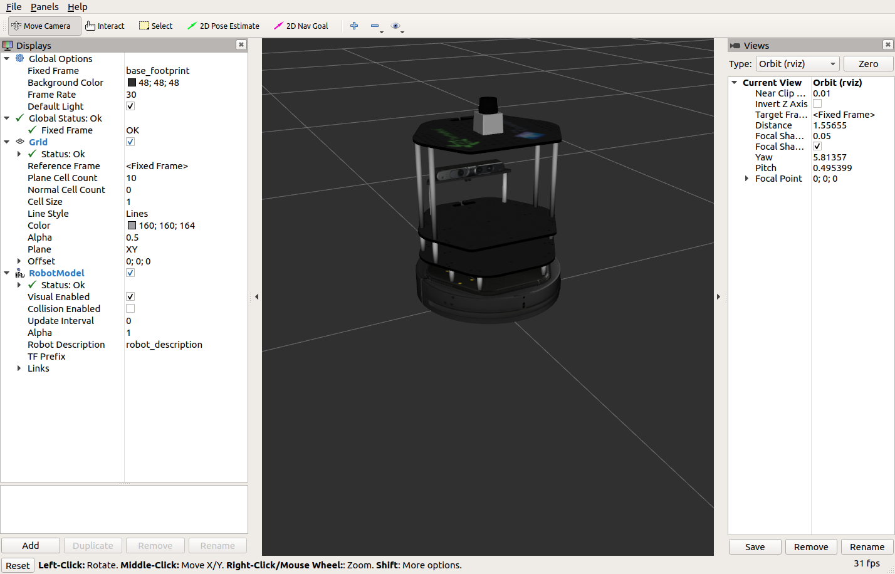

### RQT

- `rqt_topic` helps the user view all the currently running rostopic's messages at a glance.
  - `rosrun rqt_topic rqt_topic`
    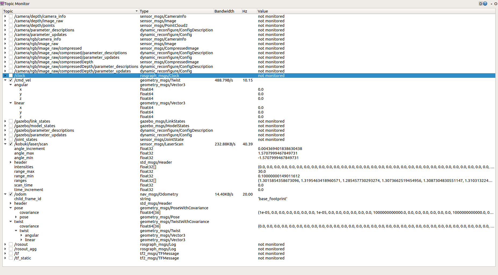
- `rqt_graph` provides the user with a flowchart view of the connections between the currently running rostopics and rosnodes.
  - `rosrun rqt_graph rqt_graph`
    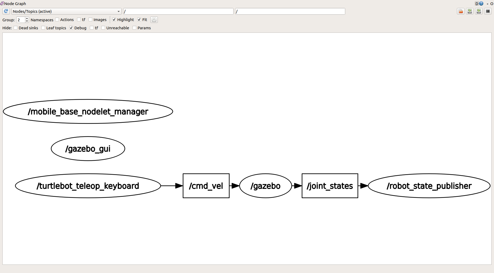

---

<br>

All robot simulations make use of **XML**, especially the `.urdf` extension. The **URDF** (Universal Robot Description Format) model is a collection of **XML** files that describe a robot's physical description. These files are used by **ROS** (Robot Operating System) to tell the computer what the robot actually looks like in real life.

## Launch in Docker

For the customized simulation, you can view it in docker too!

- Make sure you have [docker](https://docs.docker.com/engine/install/) and [docker-compose](https://docs.docker.com/compose/install/) on your OS.
  - `docker -v`
  - `docker-compose --version`
- Open a new terminal. Clone the repo below:
  ```bash
  cd ~
  git clone https://github.com/dlakhiani/iris_model.git
  cd iris_model
  xhost local:docker
  docker-compose -f docker-compose.yml build
  docker-compose -f docker-compose.yml up
  ```
  > _Please do be patient when loading Gazebo, as it will take a bit of time due to it being a graphical client._
- To control the robot, open a new terminal and type:
  ```bash
  docker exec -it iris_model_ros-develop_1 bash
  source devel/setup.bash
  rosrun iris_model teleop_twist_key.py
  ```

## Customize World

Earlier we worked with `.world` files to generate an environment for our robot. This time, we are going to customize it:

```bash
cd ~/sim_ws/src/navigation_robot
```

- Lets add some walls to our `empty_world.world`:

  ```xml
  <include>
    <uri>model://grey_wall</uri>
    <name>wall_1</name>
    <pose>5.752843 -5.123935 0 0 0 3.14</pose>
  </include>
  <include>
    <uri>model://grey_wall</uri>
    <name>wall_2</name>
    <pose>5.752843 -3.123935 0 0 0 3.14</pose>
  </include>
  <include>
    <uri>model://grey_wall</uri>
    <name>wall_3</name>
    <pose>5.752843 -1.123935 0 0 0 3.14</pose>
  </include>
  <include>
    <uri>model://grey_wall</uri>
    <name>wall_4</name>
    <pose>5.752843 1.123935 0 0 0 3.14</pose>
  </include>
  <include>
    <uri>model://grey_wall</uri>
    <name>wall_5</name>
    <pose>5.752843 3.123935 0 0 0 3.14</pose>
  </include>
  <include>
    <uri>model://grey_wall</uri>
    <name>wall_6</name>
    <pose>5.752843 5.123935 0 0 0 3.14</pose>
  </include>
  ```

- Save this under `empty_world.world`
- As it is a good practice to use a `.launch` file, we will create one now!
  - **LAUNCH** files are **XML** extensions that provide a convenient way to start up multiple nodes and a master, as well as other initialization factors.
    ```bash
    cd ~/sim_ws/src/navigation_robot
    mkdir launch
    cd launch
    touch world.launch
    ```
- Now add the below to the `world.launch` file:

  ```xml
  <?xml version="1.0" encoding="UTF-8" ?>

  <launch>
    <arg name="gui" default="true" />
    <arg name="world" default="$(find navigation_robot)/world/empty_world.world" />

    <!-- include gazebo_ros launcher -->
    <include file="$(find gazebo_ros)/launch/empty_world.launch">
        <arg name="world_name" value="$(arg world)" />
        <arg name="gui" value="$(arg gui)" />
        <arg name="use_sim_time" value="true" />
    </include>
  </launch>
  ```

  _The **arg** tag is an argument parameter that can be altered to initialize different parameter values for the launch file._

- This will execute a default launch file provided by _Gazebo_, load our world file and display the _Gazebo_ client. You can launch it by doing:
  - `roslaunch navigation_robot world.launch`
